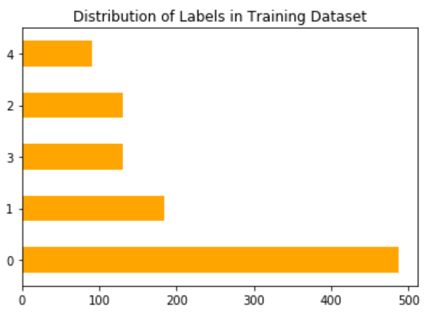
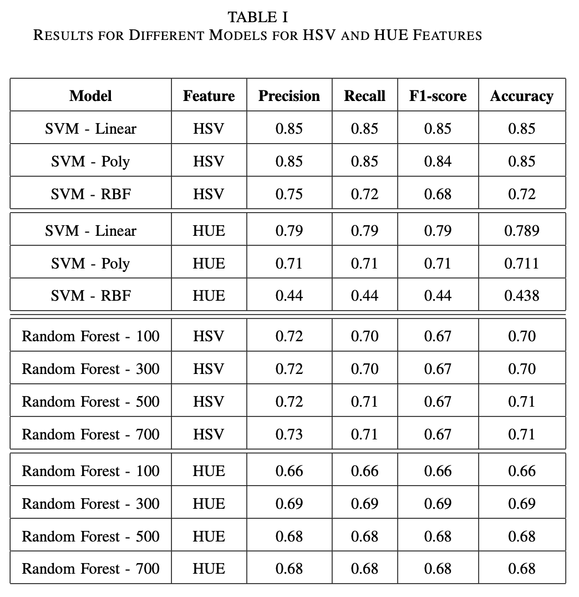

# Leaf-wilting-classification

### Motivation
Weather stress and climate change are major challenges for agriculture. Drought tolerant soybean varieties are needed but breeding for drought tolerance in soybean, is difficult. Soybean breeders evaluate thousands of field plots annually in order to select the best plants to advance for further testing or to release as a new variety. The most widely used indicator of drought tolerance/sensitivity in soybean is leaf wilting during periods of water stress1, and breeders collect this data in the most low-tech way imaginable — walking the field with a notebook and writing down ratings to indicate how wilted each field plot looks [1,2]. 

There are some limitations to this strategy. Most obviously, it’s time consuming. It’s impossible for a breeder to rate all their plots in one day. On top of that, field sites are often located far away from the office, meaning that a breeder generally must drop everything and devote an entire day to collecting wilting ratings for just a subset of their plots. We also don’t know when is best to collect wilting ratings: are the data more useful during periods of mild stress, moderate stress, or severe stress? What time of day or set of atmospheric conditions provides the most useful wilting information? How are leaf wilting ratings connected to plant physiology? These questions are hard to answer with manual annotations.

### Goal
Our goal is to use temporally high-throughput image data, which represent two different soybean genotypes responding to a wide range of atmospheric and soil moisture conditions, as a training dataset to automate leaf wilting ratings. With automated ratings, we could generate larger datasets that would allow us to answer some of the questions above. We also eventually want to automate leaf wilting ratings for hundreds or thousands of plots across a field, which is a spatially high throughput application.

### Data
Images from soybean crops at various times of the day using the configuration above are captured. The annotations corresponding to the level of wilting observed for each image are provided. 

##### Data description
The given dataset contains images of soybean crops at various times of the day. The training dataset contains 1025 images and annotations corresponding to the level of wilting observed. The level of wilting is defined from 0-4, 0 means there is no/minimum wilting and 4 means the maximum level of wilting. The test dataset contains 300 images. Each image in both train and test dataset has dimension of 640x480.

------

## Classification with Machine Learning (SVM and Random Forest)

More specific details can be found in pdf report `report.pdf` in ___ML_classification___ folder

### Methodologies
The objective of this project is to automate leaf wilting ratings of soybean crops, given images of the crop at various times of the day. In this section, we discuss the key compo- nents of our model including feature extraction and classifiers used in the experiment. Figure 2 shows the architecture and key components of our classification model.

##### Feature extraction
Image feature extraction is an essential step in any image classification task. We manually inspected an image from each class for different image features. After visual inspection of representative images of each wilting rating, we noticed that different levels of wilting had different leaf’s hue as shown in Figure 3.

Further inspection of color histograms of these images in the Hue-Saturation-Value (HSV) space confirmed this observation (Figure 4). As a result, we converted all images into HSV space and trained our models using the converted images; no other pre-processing was done.

HSV color histograms also showed that different levels of leaf wilting had different distributions of hue. As a result, we trained secondary models using only the hue channel of

### Experiment and results
A primary and secondary analysis was conducted on all of SVM and Random Forest classifiers using HSV and HUE features, respectively. The training images were randomly split into two for model evaluation: a training set and a testing set. The training set contained 717 images (70% of the dataset); the remaining images were used for testing.

Overall the SVM model with linear kernel performed the best. The model performed the best for both HSV and HUE features. SVM with polynomial kernel performed as good as the model with linear kernel for HSV features. All variants of Random Forest classifiers performed worse than SVM with Linear and Polynomial kernels. However, all the random forest classifiers outperformed the SVM model with RBF kernel. The precision, recall, F1-score and accuracy for each model with both HSV and HUE features are reported in Table 1.

### Conclusion and future work
In our experiment, we observed that HSV features were more representative of the image data than HUE features. Using HSV features increased the performance of our best model i.e. SVM with linear kernel by 6%. Although our SVM - Linear and SVM- Poly performed fairly same for HVS features, SVM-linear performed better than SVM - Poly when using HUE feature by 7.8%. For the second part we plan on experimenting with Convolution Neural Networks for the task of image classification. Since, of dataset is not balanced, in the next experiment we will handle the issues associated with the imbalanced data as well.

------

## Classification with Deep Learning (Convolutional and Residual Neural Networks)

More specific details can be found in pdf report `team3.pdf` in ___DL_classification___ folder

### Methodologies
The objective of this project is to automate leaf wilting ratings of soybean crops, given images of the crop at var- ious times of the day. In this section, we discuss the key components of our model including data pre-processing steps, network structure and model selection.

We experimented with three representations of image: HSV, hue, and RGB. Our models performed better for RGB feature space on the validation data, so we fine-tuned our models on RGB space.

##### A - Pre-processing
We resized all the images to 224×224 for faster computa- tion. Given the unbalanced nature of the dataset we performed Image augmentation using ImageGenerator to generate more samples. However, our models did not perform very well with ImageGenerator. So, we used SMOTE ( Synthetic Minority Oversampling TEchnique) for oversampling of the training data and Cluster Centroid based majority undersampling on the validation data. We split the data into train-validation sets(70%/30%) before oversampling and undersampling. After sampling, the number of samples total 1675 and 190 for training and validation sets, respectively. Incorporation of oversampling and undersampling gave us an improvement in the model’s performance.

1) ___SMOTE___: Oversampling techniques involve synthesiz- ing new examples from existing examples. Although these techniques do not add any new information to the model, they are a good way to create a balanced dataset. Synthetic Minority Oversampling TEchnique (SMOTE) [3] is particular synthesizes new examples from minority class labels.

2) ___Cluster Centroid Undersampling___: Undersampling meth- ods remove instances of majority classes from dataspace to create a balanced dataset. In Cluster Centroid method of undersampling, clusters are created from datapoints belonging to majority classes. The datapoints that is further away from the centroid are considered to be less representitive of the class and hence dropped. The remaining data points make up the dataset, in our case the validation set.
We experimented with three different models: ResNet50, VGG16 and CNN with 4 convolutional layers. All models were trained for 15 epochs with batch size of 32 (unless indicated otherwise in their respective sections).

##### B - Convolutional Neural Network
Convolutional Neural Network (CNN) is a common ar- tificial neural network structure for the image classification problem. The intuition behind CNN stems from the fact that information in digital images is often repetitive and a local understanding of an image yields adequate inference. Local understanding requires significantly less parameters (compare to fully-connected network), making training faster and more feasible. Due to its versatile and ease of implementation, we constructed a network with 4 convolutional layers as our initial classification model.

General CNN model has two main components: convo- lutional and pooling layers for features extraction, and out- put layer for classification. Each convolutional layer in our network uses a small filter of size 3x3 with ReLU as ac- tivation function followed by batch normalization. The last three convolutional layers includes pooling of size 2x2 and drop-out to avoid over-fitting and further reducing number of training parameters. Between the feature extractor and the output layer are two dense layers to interpret the features. Figure 1 shows the full detail of our CNN architecture. The model is constructed using Keras built-in library.

##### C - Transfer Learning with RESNET50
ResNet or Residual Networks are Artificial Neural Networks (ANN) that allows to train deep neural networks with high performance. ResNet50 is one of the commonly used Residual Neural networks [4] for transfer learning. Due to its high performances in various image classification tasks, we chose this implement this for our task.

ResNet50 consists of five stages and has over 23 million trainable parameters. Each of the stage contains a convolution and an identity block. The convolution block has three con- volution layers and the identity block has three convolution layers. Figure 3 shows an architecture of ResNet50 Model.

We used a pretrained ResNet50 in Keras. We experimented with Adam and Stochastic Gradient Descent as optimizers. Ta- ble 1 summarizes the hyperparameters and layers of ResNet50 we played around with.

##### D - Transfer Learning with VGG16
VGG16 is a popular very deep Convolutional Neural Net- work [5] architecture for ImageNets [6]. It is sixteen layers deep and has over 14 million trainable hyperparameters. While the number of trainable parameters is less than that of ResNet50, we assumed that VGG16 would perform well given our dataset is small.

VGG16 has only 3*3 convolutions. It contains thirteen convolution layers and 5 max pooling layers. It contains two fully connected layers and an output layer with softmax activation. Figure 4 shows an architecture of VGG16 Model. We used a pretrained VGG16 in Keras. We experimented with Adam and Stochastic Gradient Descent as optimizers.

### Experiment and results
Overall the CNN model training on HSV images had the best evaluation results. However, when it comes to making prediction on the test dataset whose ground truth is unknown (however, it is known that the class distribution in the test set is much more balanced than that of the given training data), ResNet50 model training on RGB made the most balanced set of prediction with the highest test accuracy (provided by the Professor and the grading Teaching Assistant). For all three network structures, models trained on Hue data performed the worst. The precision, recall, F1-score and accuracy for each model with each type of features are reported in Table 2. We also experimented with ResNet by freezing some of its earlier layers and updated the weights on last few layers only. While the model became more robust and the performance on the validation dataset was not compromised, the results on the scoreboard was less than what we got when we fine-tuned all of its layers. So, for our final predictions, we did not freeze any of the layers in ResNet50.

### Conclusion and future work
In our experiment, we observed that RGB features were more representative of the image data than HSV and HUE features. ResNet50 model training on RGB images did not have the best evaluation results. However, the model was able to capture characteristics for all classes and was more robust than other network structures when applied to test data. A reason for this is that the number of samples in the data given was limited, unbalanced and was not robust enough to represent images seen in the test set. ResNet50 RGB model was able to capture some of the semantic in the images without overfitting. The two other network structures either overfit the training data or fail to learn the data altogether.

Using our final ResNet50 RGB model, we were able to achieve a test accuracy of 0.40, but it is the best that we can attain given time limit and resource limit of the project. This is not a high accuracy score. Potential work that can be done to improve this includes combining oversampling and subsam- pling with data augmentation to create more robust training data, tuning dropout values, and incorporating regularization to avoid overfitting. In addition, we can experiment with more sophisticated network architectures.

------

## References
[1] King AC, Purcell LC, and Brye KR (2009) Differential wilting among soybean genotypes in response to water deficit. Crop Science 49:290-298. doi: 10.2135/cropsci2008.04.0219

[2] Pathan, SM et al. (2014) Two soybean plant introductions display slow leaf wilting and reduced yield loss under drought. Journal of Agronomy and Crop Science 200:231-236. doi: 10.1111/jac.12053

[3] N. V. Chawla, K. W. Bowyer, L. O. Hall, and W. P. Kegelmeyer, “Smote: synthetic minority over-sampling technique,” Journal of artificial intelligence research, vol. 16, pp. 321–357, 2002.

[4] K. He, X. Zhang, S. Ren, and J. Sun, “Deep residual learning for image recognition,” in Proceedings of the IEEE conference on computer vision and pattern recognition, 2016, pp. 770–778.

[5] K. Simonyan and A. Zisserman, “Very deep convolutional networks for large-scale image recognition,” arXiv preprint arXiv:1409.1556, 2014.

[6] A. Krizhevsky, I. Sutskever, and G. E. Hinton, “Imagenet classification with deep convolutional neural networks,” in Advances in neural infor- mation processing systems, 2012, pp. 1097–1105.
